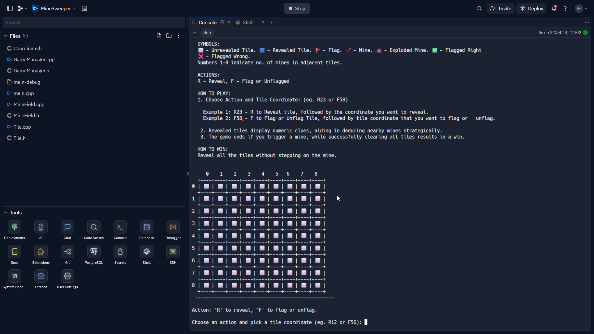
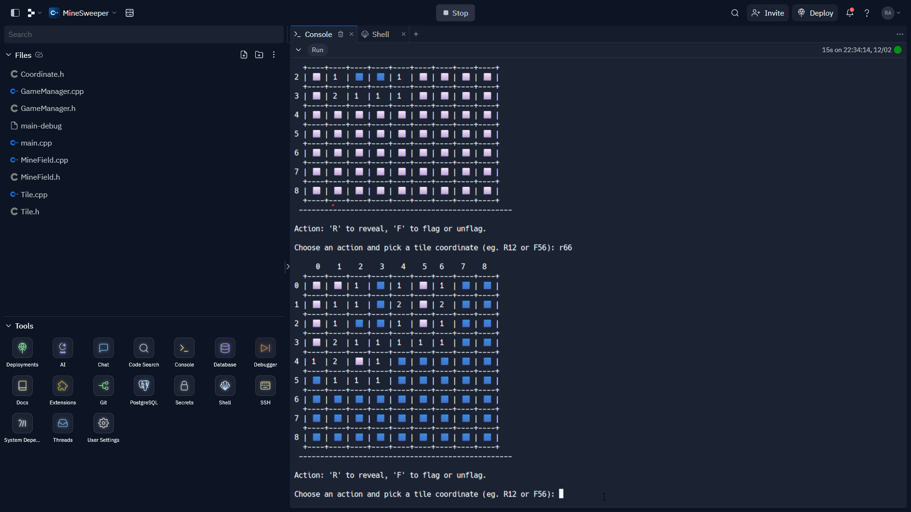
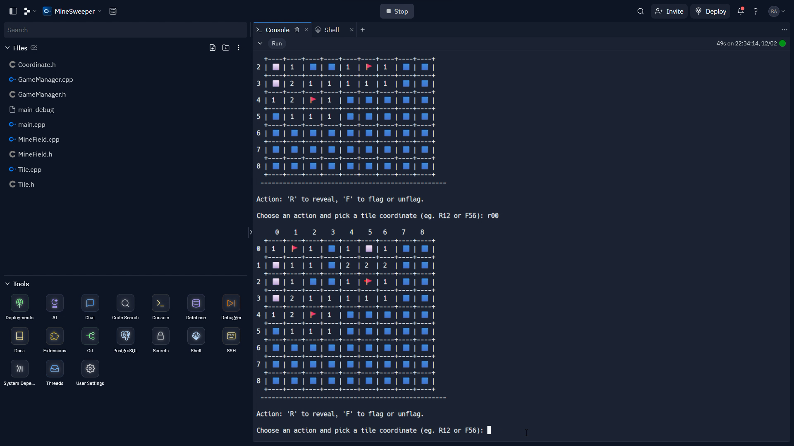
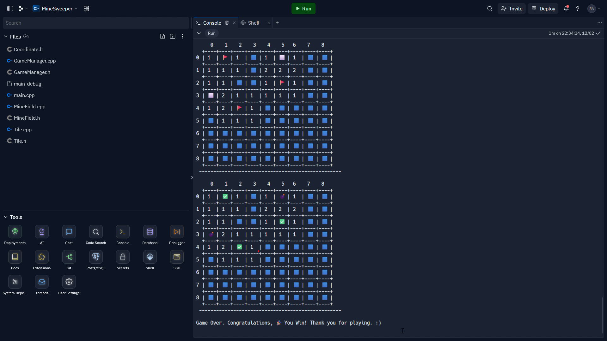

# MineSweeper

## Introduction
    Minesweeper is a classic strategy game where the objective is to open all the tiles without
    stepping on a mine. Engage in strategic decision-making and deduction as you navigate the
    minefield.
        
 ## Features
    - Classic Minesweeper gameplay with a user-friendly interface.
    - Interactive game board with tiles to reveal and mines to avoid.
    - Flags to mark potential mine locations.
    - Dynamic mine distribution for varied challenges.
    - Win and lose conditions with appropriate game over messages.
    - Support for different actions like revealing tiles and flagging/unflagging.
    
## Screenshots
   
   
   
   
   

## Implementation

    To organize the code, C++ and OOP concepts have been employed. The implementation is divided into multiple files:

    - GameManager: Manages gameplay, handles input, modifies and displays the game board, and determines game outcomes.
    - MineField: Implements the logic for creating tiles, randomly placing mines, and counting neighboring mines.
    - Tile: Stores information about each tile's status, including neighboring mines and coordinates.
    - Coordinate.h: Specifically handles coordinates, featuring a struct to store tile coordinates.
        
  ## Gameplay Demonstration

    - For a visual demonstration of the gameplay, watch video on YouTube.
  [Youtube video link](https://youtu.be/DbeLwONpoVw)

  ## Play the Game

    - To experience the game firsthand, play it directly by following this repl link.
  [Repl link](https://replit.com/@RahulPargi/MineSweeper#GameManager.cpp)
